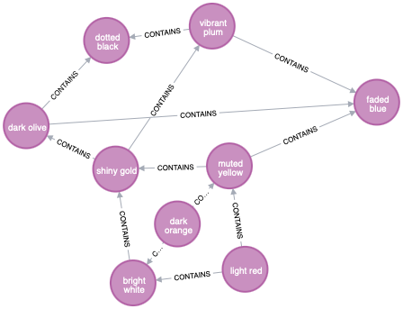

:tags: Neo4j, Cypher, JDK15, jbang

== https://adventofcode.com/2020/day/7[Handy Haversacks]

While I already used Neo4j and Cypher on https://github.com/michael-simons/aoc/tree/master/2020/day05/cypher[2020 day 5],
i did it there with a server version of Neo4j running on Docker.

I enjoyed my SQL solution with an embedded H2 for https://github.com/michael-simons/aoc/tree/master/2020/day06/sql[2020 day 6]
so much, that I wanted to try this with Neo4j as well.

While the embedded H2 was brought up by a Groovy script, I wanted to use JDK 15 for this one and try out something new:
https://www.jbang.dev[jbang].

One of my goals for that Advent of Code repository here is to try and see that all of them can be launched
via a single thing to install.
For the embedded SQL solution I chose Groovy because Groovy scripts brings http://docs.groovy-lang.org/latest/html/documentation/grape.html[Grape],
which allows to specify dependencies.

jbang brings this to the JVM.

`Solution.java` contains the following headers:

[source,java]
----
///usr/bin/env jbang "$0" "$@" ; exit $?
//JAVA 15
//DEPS org.neo4j:neo4j:4.2.1
----

This makes the script executable on it's own, specifies the required Java version
and declares the embedded Neo4j graph database as dependency.

To run this example, you need to install only jbang.

Run the example via `jbang Solution.java` or directly as ./Solution.java`.
Of course it is still a valid and runnable Java class on it's own.

The solution to the problem? It is  trivial. https://twitter.com/Der_Pesse/status/1336430352362041346[Samuel] said yesterday
"Using SQL on a well structured model feels like cheating". Well, I did use SQL here too, but one can broaden this a bit.
A database with a fitting model will answer most things very intuitive and especially, in a declarative way.
You tell the thing what you want to know, it tells you an answer.
No need to specify how to compute that answer.

Now, the data model:

Trivial, isn't it? The number how many bags are contained in the parent is stored on the relationship.
The test data looks like:

And as Cypher (with `$bags` being a list of maps like this: `[{num=0, type=light red}, {num=1, type=bright white}, {num=2, type=muted yellow}]``:

[source,cypher]
----
MERGE (outer:Bag {type: head($bags).type})
WITH outer UNWIND tail($bags) AS bag
MERGE (inner:Bag {type: bag.type})
MERGE (outer) - [:CONTAINS {num: bag.num}] -> (inner)
----

The solutions? Well, most of the Java code is about filling the database, and the
solutions are a two respectively three-line Cypher query:

Part 1, "Give me all bags that contain a bag of type 'shiny gold', either directly or indirectly and count the different bags.":

[source,cypher]
----
MATCH (bag)-[:CONTAINS*1..]->(:Bag {type:'shiny gold'})
RETURN count(DISTINCT bag) AS starOne
----

Part 2: "Take all paths from bags of type 'shiny gold' until there are no more bags contained,
take the last one and group all relationships in the path by it while using a function that does a mathematical reduction,
starting with value 1 which is multiplied with the number of bags for each contained bag.
After that, sum up all the nested bags."

[source,cypher]
----
MATCH p=(b:Bag {type:'shiny gold'})-[:CONTAINS*1..]->(otherBag)
WITH otherBag, reduce(cnt = 1, rel IN relationships(p) | cnt * rel.num) as total
RETURN sum(total) AS starTwo
----

The graph for the actual input has 1494 relations and 594 nodes.

Apart from that, I am super happy about the multiline feature in Java 15. 
Copying the queries from and into the Neo4j Cypher-Shell or Browser is so much easier
having no escapes in them and no string concatenation.

NOTE: Tested with
      jbang `0.56.0`  (`jbang version`) and `openjdk 15.0.1 2020-10-20` (`~/.jbang/cache/jdks/15/bin/java -version`). +
      +
      Correct solutions for `test-input1.txt` are `4` and `32`, +
      `0` and `126` for `test-input2.txt` and +
      `278` and `45157` for the input I was assigned with.
